# 🌿 Vue2 → Vue3 실습 프로젝트
## 📘 개요

이 프로젝트는 Vue 2로 작성된 예제 코드를  
**Vue 3 문법(Composition API)** 기반으로 변환한 실습입니다.

기존 Options API 중심의 코드를 Composition API 구조로 재작성하며,  
Vue3의 주요 개념(`ref`, `reactive`, `computed`, `watch`, `props`, `emit`, `provide/inject`)을 직접 적용했습니다.

## 🧩 주요 변경 요약

- 전체 예제(E01~E12)를 **Vue 2 문법에서 Vue 3 문법으로 변환**
- **Options API → Composition API**로 전환  
  (`setup()`, `ref`, `reactive`, `computed`, `watch`, `onMounted` 등 사용)
- `defineProps`, `defineEmits`, `defineExpose`, `defineOptions` 등 **Vue3 전용 매크로 적용**
- **provide/inject 구조 수정** → Composition API 기반으로 변경
- **props와 emit 이벤트 처리 방식 최신화**
- **lifecycle 훅 업데이트**  
  (`beforeCreate/created` → `setup()` 내부 로직으로 대체)
- 각 예제 컴포넌트 이름(`name`) 명시 및 **App.vue import 구조 정리**
- TypeScript 환경 대응을 위한 ESLint 설정 보완  
  (`env: { 'vue/setup-compiler-macros': true }` 추가)
- 전체 코드 포맷 통일 및 **Composition API 스타일로 리팩터링 완료**

🖼️ 실행 결과

| 예제 | 설명 | 스크린샷 |
|:----:|:------|:----------|
| E01 | 기본 인스턴스 생성 | 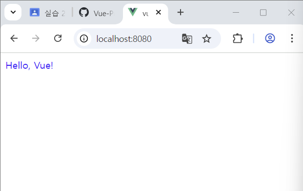 |
| E02 | 반응형 데이터 (reactive) | 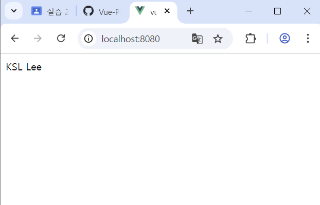 |
| E03 | 양방향 바인딩 (v-model) | 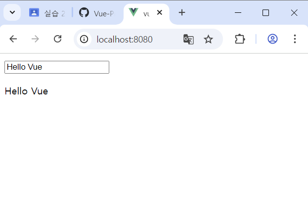 |
| E04 | computed 속성 사용 | 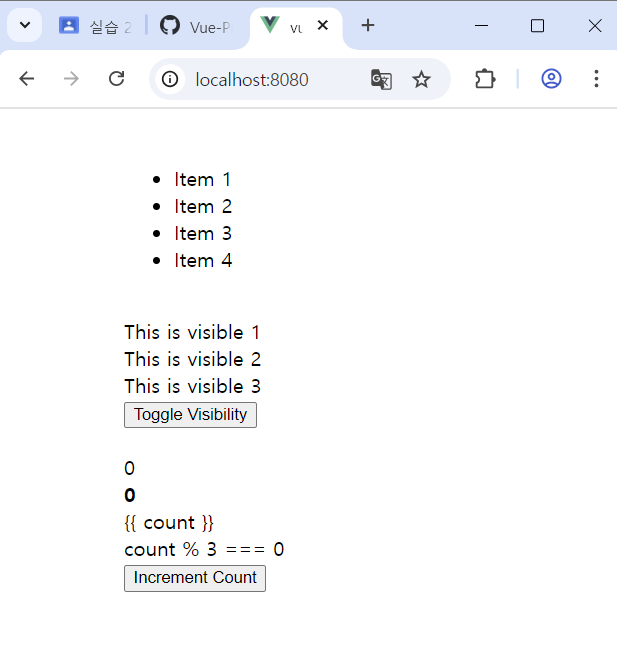 |
| E05 | 부모-자식 간 이벤트 전달 (emit) | 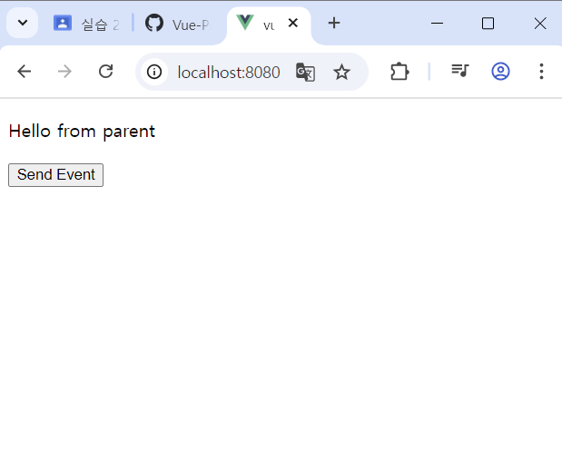 |
| E06 | provide / inject 예제 | 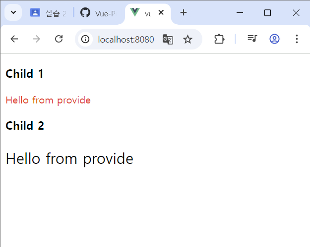 |
| E07 | Options API 구조 예제 | 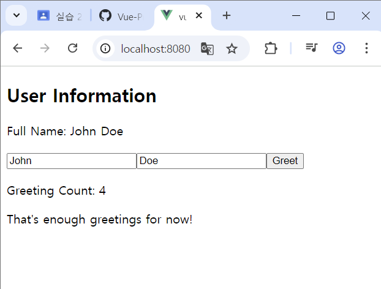 |
| E08 | Composition API 변환 예제 |  |
| E09 | `<script setup>` 버전 Composition API | 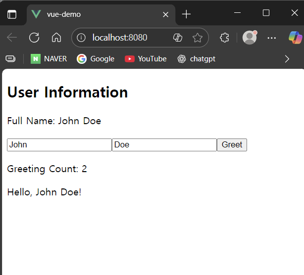 |
| E10 | ref() 기본 예제 | 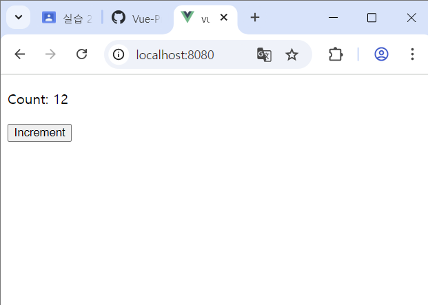 |
| E11 | reactive() 객체 예제 | 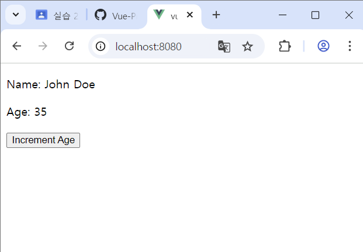 |
| E12 | DOM 참조 (template ref) 예제 | 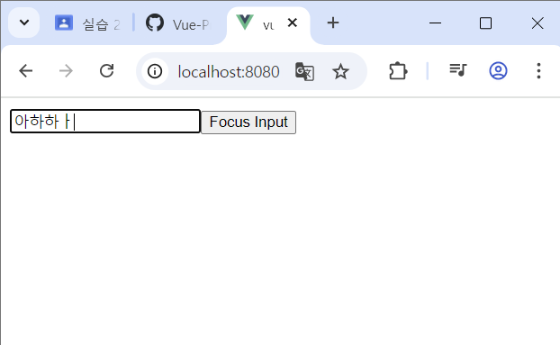 |

## 💬 정리

이번 프로젝트를 통해 Vue 2와 Vue 3의 구조적 차이를 명확히 이해하고,
특히 **Composition API의 장점(코드 재사용성, 가독성, 유지보수성)**을
직접 적용하며 학습할 수 있었습니다.

각 예제를 단계적으로 변환하면서
ref, reactive, computed, watch, props/emit, provide/inject 등의 개념을
Vue3 기준으로 익혔고, 기존 Options API 대비
구조적 일관성과 유지보수성 향상을 체감했습니다.

모든 예제가 정상적으로 동작하며,
스크린샷(E01.png ~ E12.png)을 통해 확인할 수 있습니다.